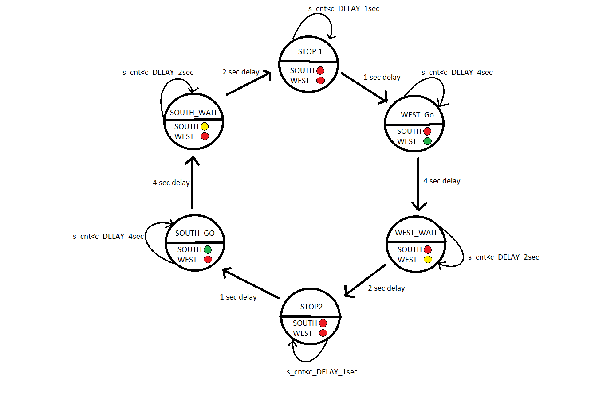

# Lab 8

## 1. Přípravné úkoly

### Stavová tabulka
| **Input P** | `0` | `0` | `1` | `1` | `0` | `1` | `0` | `1` | `1` | `1` | `1` | `0` | `0` | `1` | `1` | `1` |
| :-- | :-: | :-: | :-: | :-: | :-: | :-: | :-: | :-: | :-: | :-: | :-: | :-: | :-: | :-: | :-: | :-: |
| **Clock** |  |  |  |  |  |  |  |  |  |  |  |  |  |  |  |  |
| **State** | A | A | B | C | C | D | A | B | C | D | B | B | B | C | D | B |
| **Output R** | 0 | 0 | 0 | 0 | 0 | 1 | 0 | 0 | 0 | 1 | 0 | 0 | 0 | 0 | 1 | 0 |

Připojení RGB LED na desce NEXYS A7


Nastavení barev
| **RGB LED** | **Artix-7 pin names** | **Red** | **Yellow** | **Green** |
| :-: | :-: | :-: | :-: | :-: |
| LD16 | N15, M16, R12 | `1,0,0` | `1,1,0` | `0,1,0` |
| LD17 | N16, R11, G14 | `1,0,0` | `1,1,0` | `0,1,0` |

## 2. Ovladač semaforu

### Stavový diagram


### Výpis VHDL kódu sekvenčního procesu 

```vhdl
    p_traffic_fsm : process(clk)
    begin
        if rising_edge(clk) then
            if (reset = '1') then       -- Synchronous reset
                s_state <= STOP1 ;      -- Set initial state
                s_cnt   <= c_ZERO;      -- Clear all bits

            elsif (s_en = '1') then
                -- Every 250 ms, CASE checks the value of the s_state 
                -- variable and changes to the next state according 
                -- to the delay value.
                case s_state is

                    -- If the current state is STOP1, then wait 1 sec
                    -- and move to the next GO_WAIT state.
                    when STOP1 =>
                        -- Count up to c_DELAY_1SEC
                        if (s_cnt < c_DELAY_1SEC) then
                            s_cnt <= s_cnt + 1;
                        else
                            -- Move to the next state
                            s_state <= WEST_GO;
                            -- Reset local counter value
                            s_cnt   <= c_ZERO;
                        end if;

                    when WEST_GO =>
                        if (s_cnt < c_DELAY_4SEC) then
                            s_cnt <= s_cnt + 1;
                        else
                            s_state <= WEST_WAIT;
                            s_cnt   <= c_ZERO;
                        end if;
                        
                     when WEST_WAIT =>
                        if (s_cnt < c_DELAY_2SEC) then
                            s_cnt <= s_cnt + 1;
                        else
                            s_state <= STOP2;
                            s_cnt   <= c_ZERO;
                        end if;
                        
                      when STOP2 =>
                        if (s_cnt < c_DELAY_1SEC) then
                            s_cnt <= s_cnt + 1;
                        else
                            s_state <= SOUTH_GO;
                            s_cnt   <= c_ZERO;
                        end if;
                        
                      when SOUTH_GO =>
                        if (s_cnt < c_DELAY_4SEC) then
                            s_cnt <= s_cnt + 1;
                        else
                            s_state <= SOUTH_WAIT;
                            s_cnt   <= c_ZERO;
                        end if;
                        
                       when SOUTH_WAIT =>
                        if (s_cnt < c_DELAY_2SEC) then
                            s_cnt <= s_cnt + 1;
                        else
                            s_state <= STOP1;
                            s_cnt   <= c_ZERO;
                        end if;


                    -- It is a good programming practice to use the 
                    -- OTHERS clause, even if all CASE choices have 
                    -- been made. 
                    when others =>
                        s_state <= STOP1;

                end case;
            end if; -- Synchronous reset
        end if; -- Rising edge
    end process p_traffic_fsm;
```

### Výpis VHDL kódu procesu p_output_fsm
```vhdl
p_output_fsm : process(s_state)
    begin
        case s_state is
            when STOP1 =>
                south_o <= c_RED;
                west_o  <= c_RED;
            when WEST_GO =>
                south_o <= c_RED;
                west_o  <= c_GREEN;
            when WEST_WAIT =>
                south_o <= c_RED;
                west_o  <= c_YELLOW;
            when STOP2 =>
                south_o <= c_RED;
                west_o  <= c_RED;
            when SOUTH_GO =>
                south_o <= c_GREEN;
                west_o  <= c_RED;
            when SOUTH_WAIT =>
                south_o <= c_YELLOW;
                west_o  <= c_RED;

            when others =>
                south_o <= c_RED;
                west_o  <= c_RED;
        end case;
    end process p_output_fsm;
```


## 3. smart ovladač
### Tabulka stavů

|**Current state** | **00** (no cars) | **01** (cars to west) | **10** (cars to south) | **11** (cars both directions) |
| :-- | :-: | :-: | :-: | :-: |
| `STOP1`      | WEST_GO | WEST_GO | SOUTH_GO | WEST_GO |
| `WEST_GO`    | WEST_GO | WEST_GO | WEST_WAIT | WEST_WAIT |
| `WEST_WAIT`  | STOP2 | STOP2 | STOP2 | STOP2 |
| `STOP2`      | SOUTH_GO | WEST_GO | SOUTH_GO | SOUTH_GO |
| `SOUTH_GO`   | SOUTH_GO | SOUTH_WAIT | SOUTH_GO | SOUTH_WAIT |
| `SOUTH_WAIT` | STOP1  | STOP1 | STOP1 | STOP1 |

### Stavový diagram


### VHDL kód z procesu p_smart_traffic_fsm
```vhdl
 p_smart_traffic_fsm : process(clk)
    begin
        if rising_edge(clk) then
            if (reset = '1') then       -- Synchronous reset
                s_state <= STOP1 ;      -- Set initial state
                s_cnt   <= c_ZERO;      -- Clear all bits

            elsif (s_en = '1') then
                -- Every 250 ms, CASE checks the value of the s_state 
                -- variable and changes to the next state according 
                -- to the delay value.
                case s_state is

                    -- If the current state is STOP1, then wait 1 sec
                    -- and move to the next GO_WAIT state.
                    when STOP1 =>
                        -- Count up to c_DELAY_1SEC
                        if (s_cnt < c_DELAY_1SEC) then
                            s_cnt <= s_cnt + 1;
                        else
                            if ( senzor = "10") then
                                -- jump to south_go state
                                s_state <= SOUTH_GO;
                                -- Reset local counter value
                                s_cnt   <= c_ZERO;
                            else
                                -- Move to the next state
                                s_state <= WEST_GO;
                                -- Reset local counter value
                                s_cnt   <= c_ZERO;
                            end if;
                        end if;

                    when WEST_GO =>
                        if (s_cnt < c_DELAY_4SEC) then
                            s_cnt <= s_cnt + 1;
                        else
                            if (senzor(1) = '0') then
                                s_state <= WEST_GO;
                            else
                                s_state <= WEST_WAIT;
                                s_cnt   <= c_ZERO;
                            end if;
                        end if;
                    
                    when WEST_WAIT =>
                        if (s_cnt < c_DELAY_2SEC) then
                            s_cnt <= s_cnt + 1;
                        else
                            s_state <= STOP2;
                            s_cnt   <= c_ZERO;
                        end if;
                        
                    when STOP2 =>
                        if (s_cnt < c_DELAY_1SEC) then
                            s_cnt <= s_cnt + 1;
                        else
                            if (senzor = "01") then
                                s_state <= WEST_GO;
                                s_cnt   <= c_ZERO;
                            else
                                s_state <= SOUTH_GO;
                                s_cnt   <= c_ZERO;
                            end if;
                        end if;
                    
                    when SOUTH_GO =>
                        if (s_cnt < c_DELAY_4SEC) then
                            s_cnt <= s_cnt + 1;
                        else
                            if (senzor(0) = '0') then
                                s_state <= SOUTH_GO;
                            else
                                s_state <= WEST_WAIT;
                                s_cnt   <= c_ZERO;
                            end if;
                        end if;
                        
                    when SOUTH_WAIT =>
                        if (s_cnt < c_DELAY_2SEC) then
                            s_cnt <= s_cnt + 1;
                        else
                            s_state <= STOP1;
                            s_cnt   <= c_ZERO;
                        end if;

                    -- It is a good programming practice to use the 
                    -- OTHERS clause, even if all CASE choices have 
                    -- been made. 
                    when others =>
                        s_state <= STOP1;

                end case;
            end if; -- Synchronous reset
        end if; -- Rising edge
    end process p_smart_traffic_fsm;
```

